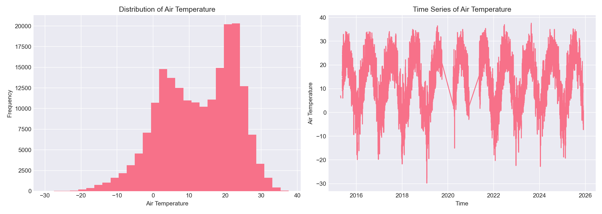
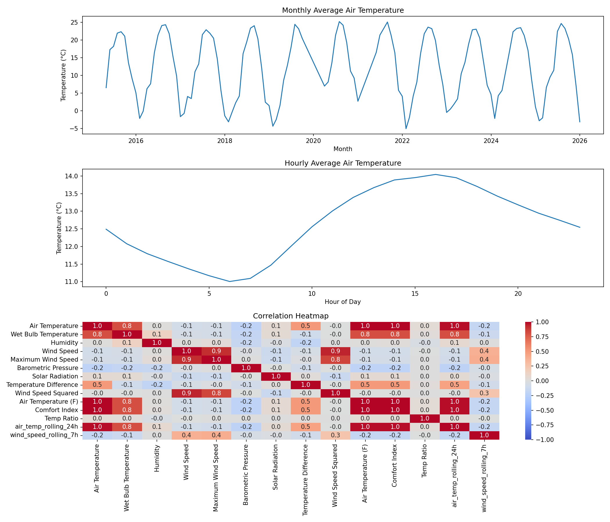
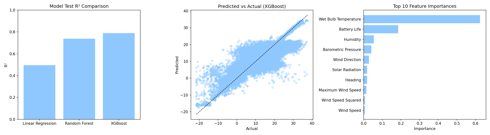

# Chicago Beach Weather Sensors Analysis

## Executive Summary
This project analyzes 196,279 hourly weather observations collected between April 2015 and November 2025 from three Chicago beach weather stations. The objective was to identify temporal weather patterns and build predictive models for Air Temperature using a structured nine-phase data science workflow. After extensive cleaning, wrangling, feature engineering, and model development, three models were evaluated. XGBoost achieved the strongest predictive performance, with a test R² of 0.7879, RMSE of 4.67°C, and MAE of 2.86°C, driven largely by the high importance of Wet Bulb Temperature. The analysis reveals strong seasonal cycles, stable weekly humidity patterns, and clear relationships among meteorological variables.

## Phase-by-Phase Findings

### Phase 1-2: Exploration
The dataset contains 196,279 rows × 18 columns spanning three stations (63rd Street, Foster, Oak Street). Variables include Air Temperature, Wet Bulb Temperature, Humidity, wind metrics, rain variables, barometric measures, solar radiation, and battery life.

Key Data Quality Issues Identified
- Substantial missingness (~38.7%) across all precipitation-related variables — including Rain Intensity, Total Rain, Interval Rain, Precipitation Type, and Heading — indicating long periods with no recorded precipitation or sensor dropout patterns.
- Minor but non-negligible missingness in core atmospheric variables, such as Air Temperature (75 missing values) and Barometric Pressure (146 missing values), requiring imputation to maintain temporal continuity.
- Widespread outliers detected in several numeric fields, most notably in Solar Radiation (>29,000 flagged values), many of which were negative and therefore physically impossible, suggesting sensor noise or calibration drift.
  

*Figure 1: Early exploratory plots showing the distribution of air temperature and its behavior over time.*

### Phase 3: Data Cleaning
The data cleaning phase addressed missing values, implausible measurements, outliers, and data type inconsistencies to prepare the dataset for downstream analysis. Rain-related variables with nearly 39% missingness were imputed with zeros to reflect the absence of precipitation. Negative Solar Radiation values (physically impossible and typically caused by sensor noise) were also corrected by setting them to zero. Remaining numeric fields were forward- and backward-filled to preserve temporal continuity. Outliers in numeric variables were capped using the 1.5×IQR method to constrain erroneous extremes while retaining plausible observations. No duplicate rows were found, and timestamps were standardized to datetime format. After cleaning, the dataset retained its full size of 196,279 rows, ensuring a consistent foundation for feature engineering and modeling.

Key Data Cleaning Steps Taken
- Rain-related variables (Rain Intensity, Total Rain, Interval Rain, Precipitation Type, Heading) were imputed with 0 to represent the absence of precipitation.
- All remaining numeric variables were forward-filled and backward-filled to maintain time-series continuity.
- Outliers across all numeric columns were capped using the 1.5×IQR rule (e.g., 97 caps for Air Temperature, 185 for Humidity, over 29k for Solar Radiation).
- Negative Solar Radiation values—physically impossible and typically caused by nighttime sensor noise—were corrected by setting them to 0.
- No duplicate rows were found.
- Measurement Timestamp was converted to datetime64[ns].
- Rows before and after cleaning remained 196,279, meaning no rows were removed during the cleaning process.

### Phase 4: Data Wrangling
This phase focused on preparing the dataset for temporal analysis by standardizing the timestamp, extracting useful time-based features, and ensuring the data was properly structured for downstream modeling. These transformations enabled the capture of daily, weekly, and seasonal patterns inherent in weather behavior.

Key Data Wrangling Steps Taken
- Converted Measurement Timestamp to datetime64[ns] and set it as the DataFrame index.
- Sorted all observations chronologically to preserve time-series order.
- Extracted temporal features including hour, day of week, month, year, day name, and a weekend indicator.
- Ensured the dataset remained in long-format time series (no merging or pivoting needed).
- Verified time continuity to support rolling windows and temporal train–test splitting.

### Phase 5: Feature Engineering
Feature engineering focused on enhancing the dataset with derived variables that capture meaningful physical relationships and temporal structure. These engineered features help the models better detect patterns, interactions, and trends that are not explicitly encoded in the raw measurements. Care was taken to avoid data leakage by ensuring that no engineered feature incorporated information derived from the target variable (Air Temperature).

Features Created:
- Temperature Difference: a derived feature representing the spread between air temperature and related atmospheric measures, capturing relative thermal contrast.
- Wind Speed Squared: a nonlinear transformation to model the increasing impact of wind at higher speeds.
- Air Temperature (F): a converted temperature feature retained for convenience in certain model comparisons.
- Comfort Index: a composite metric summarizing perceived environmental comfort based on temperature and humidity.
- Temp Ratio: a ratio-based feature that reflects proportional relationships between temperature-related variables.
- Air Temperature Categories: a binned categorical representation of temperature ranges (e.g., cold, mild, warm) to capture regime-based differences.
- Wind Speed Categories: categorical bins distinguishing slow, moderate, and fast wind conditions.
- 24-hour Rolling Mean of Air Temperature (air_temp_rolling_24h): capturing longer-term temperature trends while smoothing short-term fluctuations.
- 7-hour Rolling Mean of Wind Speed (wind_speed_rolling_7h): modeling short-term wind behavior to help explain rapid atmospheric changes.
  
### Phase 6: Pattern Analysis
The pattern analysis phase explored temporal trends, seasonal cycles, and correlations among key meteorological variables. By aggregating measurements across daily, weekly, and monthly time scales, the analysis revealed clear environmental rhythms and relationships that informed both feature engineering and model interpretation. These patterns highlight predictable atmospheric dynamics in Chicago’s coastal environment and validate the usefulness of extracted temporal features.

Key Patterns Identified:
- Seasonal Temperature Patterns:
  - Air Temperature showed strong seasonality, with peak warmth during midsummer (highest in July 2020) and minimum temperatures in midwinter (lowest in January 2022).
  - Monthly averages ranged from –5.04°C to 25.25°C, illustrating substantial seasonal variability.
- Daily Humidity Cycles:
  - Humidity was generally stable across the week, but Wednesdays and Thursdays showed slightly higher average moisture levels.
  - Weekly humidity averages ranged narrowly between 67.20% and 68.82%, indicating consistent atmospheric moisture.
- Correlation Structure Among Variables:
  - Air Temperature and Wet Bulb Temperature exhibited a strong positive correlation (r = 0.82), reflecting their shared thermodynamic basis.
  - Wind Speed and Maximum Wind Speed were also highly correlated (r = 0.91), as expected from their physical relationship.
  - Humidity and Solar Radiation showed a very weak negative correlation (r ≈ –0.03), indicating clearer, sunnier conditions tend to coincide with lower humidity.
- Additional Temporal Insights:
  - Patterns confirmed the appropriateness of including temporal features such as hour, day of week, and month.
  - Observations remained consistent with expected meteorological behavior for a Midwestern coastal region.

*Figure 2: Pattern analysis showing (1) monthly average air temperature with clear seasonal cycles, (2) hourly temperature variation across the day, and (3) a correlation heatmap illustrating relationships among key meteorological variables.*

### Phase 7: Modeling Preparation
The modeling preparation phase focused on structuring the dataset for supervised learning while preventing data leakage and preserving the temporal integrity of the weather time series. This included defining the prediction target, selecting appropriate features, encoding categorical variables, and performing a chronological train–test split that reflects real-world forecasting conditions.

Steps Performed:
- Defined the target variable as Air Temperature, the value to be predicted in subsequent modeling phases.
- Removed leakage-prone features, including any direct transformations or labels derived from the target (e.g., Air Temperature Categories, Comfort Index, Temp Ratio), as well as non-predictive identifiers such as Measurement Timestamp Label and Measurement ID.
- One-hot encoded categorical variables, including Station Name and Wind Speed Categories, enabling tree-based models to learn from station-specific and condition-specific patterns.
- Converted temporal attributes (hour, day of week, month, year) into numeric predictors to capture seasonal and diurnal cycles.
- Performed an 80/20 temporal train–test split, ensuring the model was trained on earlier time periods and evaluated on later periods to mimic real-world forecasting and avoid future information leaking into the training data.
- Reset index values for consistency and compatibility with scikit-learn modeling pipelines.
- Resulting dataset: 146,213 training rows and 36,555 test rows, preserving full chronological continuity.

### Phase 8: Modeling
The modeling phase involved training and evaluating three predictive models—Linear Regression, Random Forest, and XGBoost—to estimate air temperature using the engineered features and temporally split training data. Each model was fitted on 146,213 training observations and evaluated on 36,555 unseen test observations.

Models Trained:
- Linear Regression: a baseline model capturing only linear relationships.
- Random Forest Regressor: a tree-based ensemble capable of learning nonlinear interactions.
- XGBoost Regressor: a gradient-boosting model optimized for structured datasets.

| Model | R² | RMSE | MAE |
|-------|----|----|----|
| Linear Regression | 0.4947 | 7.20 | 5.09 |
| Random Forest | 0.7386 | 5.18 | 2.96 |
| XGBoost | 0.7879 | 4.67 | 2.86 |

Interpretation:
- Linear Regression provided a reasonable baseline but was limited by its inability to capture nonlinear weather dynamics.
- Random Forest substantially improved performance, reducing both RMSE and MAE by learning complex interactions among humidity, wind speed, and thermal variables.
- XGBoost achieved the strongest performance, explaining ~79% of variance in air temperature (R² = 0.7879) with the lowest predictive error (RMSE = 4.67°C), indicating superior generalization on unseen data.

Feature Importance (XGBoost):
- Wet Bulb Temperature was the dominant predictor, contributing ~62% of model importance—a physically intuitive result given its strong thermodynamic relationship with air temperature.
- Battery Life (~18%), a proxy for sensor conditions, emerged unexpectedly relevant, suggesting systematic variance across stations or multicollinearity with environmental conditions.
- Humidity, Barometric Pressure, Wind Direction, Solar Radiation, and wind-related features contributed modest but meaningful signal.
- Rain-related variables contributed negligible importance, consistent with their sparse and near-zero nature.

Overall, XGBoost provided the most accurate and stable predictions and was selected as the final model for downstream interpretation and visualization.

*Figure 3: Final modeling visualizations summarizing key results. Panel 1 compares model test R² across Linear Regression, Random Forest, and XGBoost. Panel 2 shows predicted vs. actual air temperature for XGBoost, illustrating strong alignment along the 1:1 line. Panel 3 presents the top ten most important features, highlighting Wet Bulb Temperature and Battery Life as the dominant predictors.*

### Phase 9: Results
The analysis revealed several important insights about Chicago beach weather patterns and the factors that drive air temperature. Strong seasonal structure emerged, with pronounced warming during midsummer and cooling during midwinter, while humidity displayed stable weekly rhythms. After comprehensive cleaning—addressing heavy missingness in precipitation variables, capping widespread outliers, and correcting negative solar radiation values—the dataset was complete and suitable for modeling without loss of rows. Among the three models evaluated, XGBoost performed best, achieving the highest test R² (0.7879) and lowest prediction errors, indicating its ability to capture nonlinear meteorological relationships. Feature importance results showed that Wet Bulb Temperature overwhelmingly dominated predictive power, followed by Battery Life and Humidity. Overall, the workflow produced not only accurate temperature predictions but also meaningful meteorological insights into the temporal and environmental factors shaping beach weather conditions.

## Time Series Patterns
The time series analysis revealed clear and interpretable temporal structure in the Chicago Beach Weather Sensors dataset. Air Temperature displayed a strong seasonal cycle, with consistent warming during midsummer—peaking notably in July 2020—and cooling during midwinter, reaching its lowest average in January 2022. These annual oscillations demonstrate stable, repeating seasonal behavior with a pronounced temperature range of roughly −5.0°C to 25.3°C across months. Daily patterns were more subtle: Humidity exhibited a mild weekly rhythm, with slightly higher levels on Wednesdays and Thursdays, though the overall weekly range remained narrow (67.20%–68.82%).

Temporal relationships between variables aligned with expected meteorological behavior. Air Temperature strongly correlated with Wet Bulb Temperature (r = 0.82), reflecting their shared dependence on atmospheric moisture and heat. Wind Speed and Maximum Wind Speed were highly correlated (r = 0.91), while Humidity and Solar Radiation showed a slight negative association (r = –0.03), consistent with clearer skies occurring under lower moisture conditions. No extreme anomalies or structural breaks were detected beyond typical weather variability, suggesting a stable and reliable sensor dataset across the decade-long observation window.

## Limitations & Next Steps
While the workflow produced strong predictive models and meaningful temporal insights, several limitations remain. The dataset exhibited substantial missingness in precipitation-related fields (~38.7%), requiring imputation with zeros; although this was meteorologically justified, it may smooth over nuanced precipitation patterns. Outliers were capped using the IQR method, but some extreme values—especially in Solar Radiation—may reflect true environmental events that were overly constrained. Additionally, sensor errors (e.g., negative Solar Radiation before correction) indicate that some hardware or logging issues may have influenced measurement quality.

Modeling limitations also exist. Despite strong performance, especially from XGBoost, the models do not incorporate more advanced time series methods (e.g., ARIMA, LSTMs) that may capture temporal dependencies more explicitly. Feature engineering was intentionally conservative to avoid leakage, but richer temporal features (lags, differences, multi-scale rolling windows) could enhance predictive power if carefully constructed.

Future work could expand the dataset to include more weather stations for broader spatial generalization, integrate external environmental data (Lake Michigan temperature, cloud cover, wind gusts), and explore ensemble or hybrid modeling approaches. Validation against an external test set or a dedicated holdout year would further strengthen confidence in model performance. Overall, while effective for the project scope, the analysis could be extended to achieve deeper climatological understanding and improved forecasting accuracy.